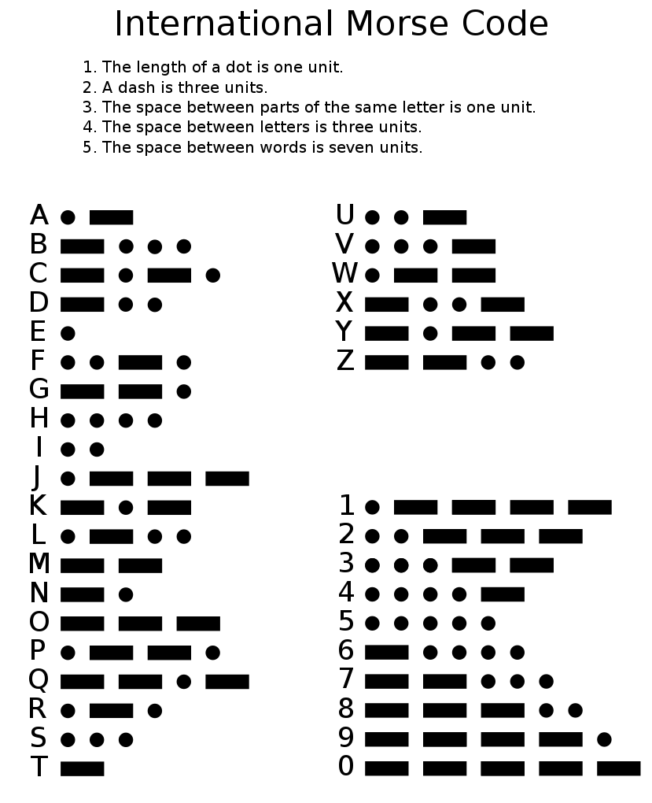

# Exercise 03 - Capture time-pattern of button presses - Morse Code

[Exercise Python script](./exercise03.py)

[Exercise 03 Questions](#questions)

This Python script is a rudimentary
[Morse Code](https://en.wikipedia.org/wiki/Morse_code)
decoder and playback system using a tactile switch and onboard LED.
Numerous microcontroller implementations of Morse Code decoders have existed for decades.
This one is very simple, but is enough to demonstrate time-dependent reading of a digital input.

A more sophisticated implementation would use dynamic thresholds instead of fixed dot/dash times--we're not going to do that here, but it leads into Question 1.
That is, in a real system, we'd want to be running more code than this that requires us to not have such a "good" i.e. small sample time.
That's because each loop iteration must complete within the allotted time (especially if in the same thread, but even if in a separate thread) to measure dot-dash timing.

## Questions

### Question 1

Suppose I want to add additional code that requires me to increase sample time, to allow more time for the additional code to execute.
What is the tradeoff when I increase sample time relative to the "dot_dash_threshold" value?
Try this by increasing "sample_ms" in exercise3.json on the Pico.
The effect should be quite noticeable.
